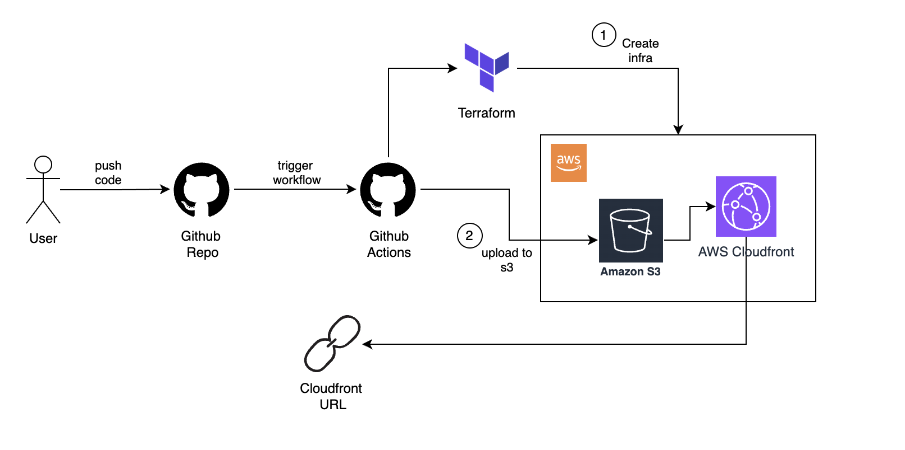

# SiteDrop 🚀

**The simplest way to host static websites on AWS with CloudFront CDN**

SiteDrop automates the entire process of deploying static websites to AWS using S3 and CloudFront, with Terraform managing the infrastructure and GitHub Actions handling the deployment pipeline.



## ✨ Features

- **🌍 Global CDN**: CloudFront distribution for lightning-fast global delivery
- **🛡️ Secure**: S3 bucket with Origin Access Identity (OAI) - no public access
- **⚡ Zero Configuration**: Fork, configure secrets, and deploy
- **💰 Cost Effective**: Pay only for what you use (S3 storage + CloudFront requests)
- **🔄 Persistent State**: Terraform state managed remotely for consistent deployments
- **🚀 Auto-Deploy**: Push to main branch = automatic deployment
- **📱 Production Ready**: HTTPS enabled, custom error pages, compression
- **🔧 Easy Updates**: Update repository description with live URL automatically

## 🏗️ Architecture

SiteDrop creates a complete AWS infrastructure:

- **S3 Bucket**: Stores your static files securely (private bucket)
- **CloudFront Distribution**: Global CDN with HTTPS and compression
- **Origin Access Identity**: Secure connection between CloudFront and S3
- **Remote State Backend**: S3 + DynamoDB for Terraform state management
- **Automated Deployment**: GitHub Actions handles everything

## 🚀 Quick Start

### 1. Fork this Repository
Click the "Fork" button to create your own copy of SiteDrop.

### 2. Set Up AWS Credentials
You'll need AWS credentials with appropriate permissions (see [Setup Guide](SETUP.md) for details).

### 3. Configure GitHub Secrets
Add these secrets to your repository (Settings → Secrets and variables → Actions):

```
AWS_ACCESS_KEY_ID=your_aws_access_key
AWS_SECRET_ACCESS_KEY=your_aws_secret_key
GH_PAT=your_github_personal_access_token
```

### 4. Add Your Website
Replace the contents of the `site/` folder with your static website files:
- `site/index.html` - Your main page
- `site/style.css` - Your stylesheets
- `site/main.js` - Your JavaScript
- Any other static assets (images, fonts, etc.)

### 5. Deploy
Push your changes to the main branch:
```bash
git add .
git commit -m "Deploy my awesome website"
git push origin main
```

That's it! GitHub Actions will:
1. Create AWS infrastructure (first time only)
2. Upload your files to S3
3. Configure CloudFront CDN
4. Provide you with a live HTTPS URL
5. Update your repository description with the live URL

## 📁 Project Structure

```
sitedrop/
├── .github/workflows/
│   ├── deploy.yml          # Main deployment workflow
│   └── destroy.yml         # Infrastructure cleanup workflow
├── infra/                  # Terraform infrastructure code
│   ├── main.tf            # AWS resources definition
│   ├── provider.tf        # Terraform provider configuration
│   ├── variables.tf       # Input variables
│   └── outputs.tf         # Output values (URLs, IDs)
├── site/                   # 👈 PUT YOUR WEBSITE HERE
│   ├── index.html         # Your main page
│   ├── style.css          # Your styles
│   ├── main.js           # Your JavaScript
│   └── [your assets]     # Images, fonts, etc.
├── examples/              # Example websites
├── diagrams/              # Architecture diagrams
├── README.md             # This file
└── SETUP.md              # Detailed setup instructions
```

## 💰 Cost Estimation

SiteDrop is extremely cost-effective:

| Service | Cost | Details |
|---------|------|---------|
| **S3 Storage** | ~$0.023/GB/month | Your website files |
| **CloudFront** | ~$0.085/GB transferred | First 1TB/month: $0.085/GB |
| **S3 Requests** | ~$0.0004/1000 requests | GET requests |
| **Terraform State** | ~$0.023/GB/month | State file storage |
| **DynamoDB** | Free tier | State locking (on-demand) |

**Example**: A 10MB website with 1000 monthly visitors ≈ **$0.50/month**

**AWS Free Tier**: New AWS accounts get significant free usage for the first 12 months.

## 🔧 Management

### Updating Your Website
1. Edit files in the `site/` directory
2. Commit and push to main branch
3. GitHub Actions automatically deploys changes
4. Changes propagate globally via CloudFront

### Viewing Deployment Status
- Go to the "Actions" tab in your GitHub repository
- Monitor the "Deploy SiteDrop" workflow
- View deployment logs and live URL in the output

### Destroying Infrastructure
To completely remove all AWS resources:
1. Go to "Actions" tab
2. Select "Destroy SiteDrop Infra" workflow
3. Click "Run workflow"
4. Confirm by running the workflow

⚠️ **Warning**: This permanently deletes your website and all AWS resources.

## 🌐 Custom Domain (Optional)

After deployment, you can use your own domain:

1. Get your CloudFront distribution URL from the deployment output
2. In your domain's DNS settings, create a CNAME record:
   ```
   www.yourdomain.com → d1234567890.cloudfront.net
   ```
3. For apex domain (yourdomain.com), use ALIAS record (Route 53) or ANAME record

For SSL with custom domain, you'll need to request a certificate in AWS Certificate Manager and update the CloudFront distribution.

## 🛡️ Security Features

- **Private S3 Bucket**: Your files are not publicly accessible via S3
- **Origin Access Identity**: Only CloudFront can access your S3 bucket
- **HTTPS Only**: CloudFront serves all content over HTTPS
- **State Encryption**: Terraform state is encrypted in S3
- **State Locking**: DynamoDB prevents concurrent modifications
- **Least Privilege**: IAM permissions follow principle of least privilege

## 🔍 Monitoring & Troubleshooting

### Checking Your Site
After deployment, you'll get:
- **Live URL**: `https://d1234567890.cloudfront.net`
- **CloudFront Distribution ID**: For cache management
- **S3 Bucket Name**: For direct file access (if needed)

### Common Issues

| Issue | Solution |
|-------|----------|
| **403 Forbidden** | Check if `index.html` exists in `site/` folder |
| **Deployment fails** | Verify AWS credentials and permissions |
| **Old content showing** | CloudFront cache - wait 5-10 minutes or invalidate cache |
| **GitHub secrets error** | Ensure all three secrets are correctly set |

### Cache Invalidation
CloudFront caches content for performance. The deployment automatically invalidates the cache, but if needed, you can manually invalidate via AWS Console.

## 📚 Examples

Check the `examples/` directory for:
- Simple portfolio website
- Multi-page sites
- Sites with custom CSS/JS
- Image galleries
- Documentation sites

## 🤝 Contributing

Contributions are welcome! Please:
1. Fork the repository
2. Create a feature branch
3. Make your changes
4. Test thoroughly
5. Submit a pull request

## 📄 License

MIT License - see [LICENSE](LICENSE) file for details.

## 🆘 Support

- 📖 **Documentation**: [SETUP.md](SETUP.md) for detailed setup instructions
- 🐛 **Issues**: Create GitHub issues for bugs or feature requests
- 💬 **Discussions**: Use GitHub Discussions for questions
- 📧 **Contact**: Check repository owner's profile for contact info

---

**SiteDrop**: From static files to global CDN in minutes. Made with ❤️ for developers who want simple, fast, and secure static site hosting.
