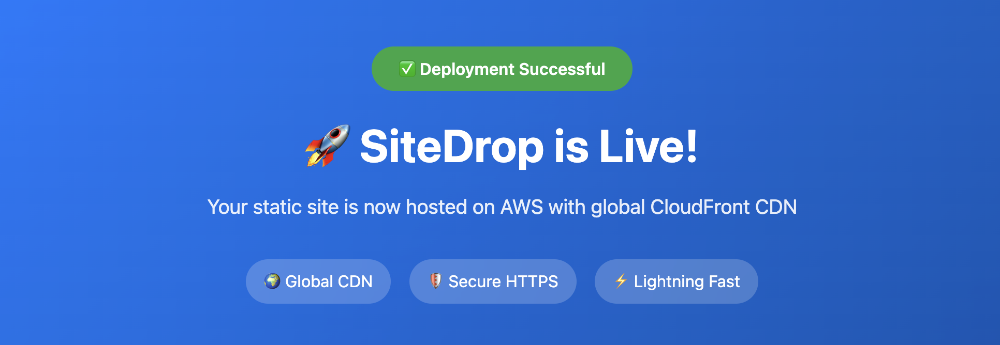

# SiteDrop Setup Guide 🛠️

This guide walks you through setting up SiteDrop from scratch, including AWS configuration and GitHub setup.

## Prerequisites

- AWS Account (free tier works)
- GitHub Account
- Basic familiarity with Git

## 📋 Step-by-Step Setup


### Environment Variables

You can customize deployment by adding these optional variables in the `user.tfvars` file in the `infra/` directory:

| Secret Name | Default | Description |
|-------------|---------|-------------|
| `AWS_REGION` | `us-east-1` | AWS region for resources |
| `PROJECT_NAME` | `sitedrop` | Prefix for AWS resource names |

### Step 1: Fork the Repository

1. Go to the [SiteDrop repository](https://github.com/udit710/SiteDrop)
2. Click the **"Fork"** button in the top-right corner
3. Choose your GitHub account as the destination
4. Wait for the fork to complete

### Step 2: AWS IAM Setup

#### 2.1 Create IAM User

1. Log into [AWS Console](https://console.aws.amazon.com/)
2. Navigate to **IAM** → **Users** → **Create user**
3. Enter username: `sitedrop-deployer` (or any name you prefer)
4. Select **"Provide user access to the AWS Management Console"** - **NOT required**
5. Click **"Next"**

#### 2.2 Attach Permissions

1. Choose **"Attach policies directly"**
2. Click **"Create policy"** to create a custom policy
3. In the policy editor, select **"JSON"** tab
4. Replace the default policy with this **SiteDrop policy**:

```json
{
    "Version": "2012-10-17",
    "Statement": [
        {
            "Sid": "SiteDropFullAccess",
            "Effect": "Allow",
            "Action": [
                "s3:*",
                "cloudfront:*",
                "iam:*",
                "dynamodb:*"
            ],
            "Resource": "*"
        }
    ]
}
```

5. Click **"Next"**
6. Enter policy name: `SiteDropDeploymentPolicy`
7. Enter description: `Full access policy for SiteDrop static site deployment`
8. Click **"Create policy"**
9. Go back to user creation, refresh policies, and search for `SiteDropDeploymentPolicy`
10. Select the policy and click **"Next"**
11. Click **"Create user"**

#### 2.3 Generate Access Keys

1. In the IAM Users list, click on your newly created user
2. Navigate to **"Security credentials"** tab
3. Scroll down to **"Access keys"** section
4. Click **"Create access key"**
5. Select **"Command Line Interface (CLI)"**
6. Check the confirmation checkbox
7. Click **"Next"**
8. Add description: `SiteDrop GitHub Actions deployment`
9. Click **"Create access key"**
10. **IMPORTANT**: Copy and save both:
    - **Access key ID**
    - **Secret access key**

⚠️ **Security Note**: Never commit these keys to your repository or share them publicly.

### Step 3: GitHub Personal Access Token (PAT)

#### 3.1 Create Fine-Grained PAT

1. Go to GitHub → **Settings** → **Developer settings** → **Personal access tokens** → **Fine-grained tokens**
2. Click **"Generate new token"**
3. Configure the token:
   - **Token name**: `SiteDrop Repository Update`
   - **Expiration**: 90 days (or longer as preferred)
   - **Resource owner**: Select your account
   - **Repository access**: Select your forked SiteDrop repository

#### 3.2 Set Repository Permissions

In the **"Repository permissions"** section, grant these permissions:

| Permission | Access Level | Why Needed |
|------------|--------------|------------|
| **Administration** | **Write** | Update repository description with live URL |
| **Contents** | Read | Access repository files |
| **Metadata** | Read | Access repository information |

#### 3.3 Generate Token

1. Click **"Generate token"**
2. **IMPORTANT**: Copy and save the token immediately
3. You won't be able to see it again!

### Step 4: Configure GitHub Secrets

#### 4.1 Add Repository Secrets

1. Go to your forked repository on GitHub
2. Navigate to **Settings** → **Secrets and variables** → **Actions**
3. Click **"New repository secret"** for each of the following:

| Secret Name | Value | Description |
|-------------|-------|-------------|
| `AWS_ACCESS_KEY_ID` | Your AWS access key ID | From Step 2.3 |
| `AWS_SECRET_ACCESS_KEY` | Your AWS secret access key | From Step 2.3 |
| `GH_PAT` | Your GitHub fine-grained PAT | From Step 3.3 |

#### 4.2 Verify Secrets

After adding all secrets, you should see:
- ✅ `AWS_ACCESS_KEY_ID`
- ✅ `AWS_SECRET_ACCESS_KEY`
- ✅ `GH_PAT`

### Step 5: Prepare Your Website

#### 5.1 Clone Your Fork

```bash
git clone https://github.com/YOUR_USERNAME/SiteDrop.git
cd SiteDrop
```

#### 5.2 Replace Default Content

The `site/` directory contains a sample portfolio. Replace it with your content:

```
site/
├── index.html          # Your main page (required)
├── style.css          # Your stylesheets
├── main.js           # Your JavaScript
├── images/           # Your images
├── assets/           # Other assets
└── [other files]     # Any other static files
```

**Requirements**:
- Must have `index.html` as the main page
- All files must be static (no server-side processing)
- Recommended: Keep total size under 100MB for fast uploads

### Step 6: Deploy Your Site

#### 6.1 Push Your Changes

```bash
git add .
git commit -m "Add my website content"
git push origin main
```

#### 6.2 Monitor Deployment

1. Go to your repository on GitHub
2. Click the **"Actions"** tab
3. You should see a **"Deploy SiteDrop"** workflow running
4. Click on the workflow to see detailed logs
5. Wait for completion (usually 3-5 minutes)

#### 6.3 Get Your Live URL

After successful deployment, check:
1. The workflow output for your live URL
2. Your repository description (should be updated automatically)
3. The URL format: `https://d[random].cloudfront.net`
4. The repository description should now show your live site URL

## Successful Deployment!

Upon completion, you should see the following page on visiting the URL:

